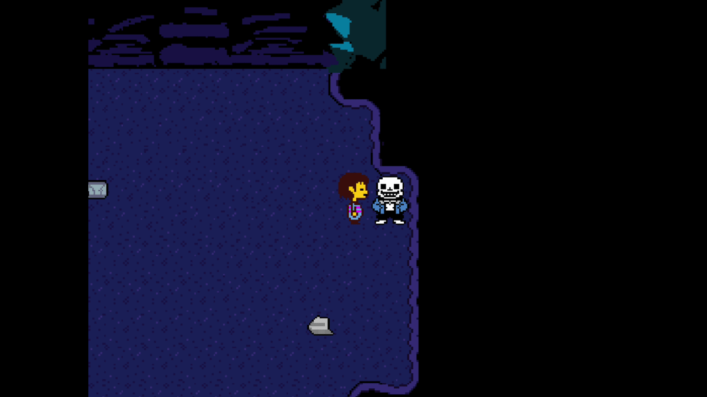
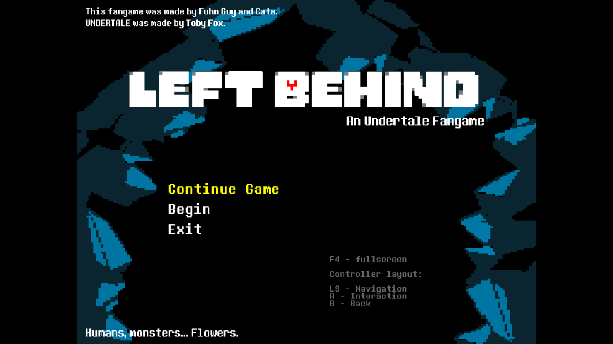
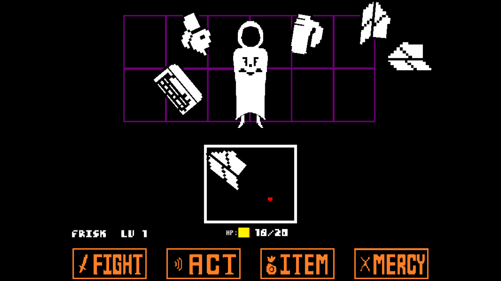
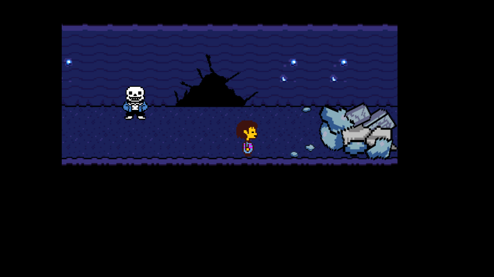

# Left-Behind

LEFT BEHIND is an unofficial fan-game of Toby Fox's UNDERTALE, this fangame features a short side story that takes place after the events of the true pacifist ending. Frisk returns to the underground once again and is now tasked by Asgore to secure a safe passage to the monsters remaining there. But, that won't be easy as Waterfall has been struck by earthquakes, slowing down the evacuation process. It is now up to Frisk to stop these seisms and find who is responsible.

The game features:

- A map which you can explore and interact with.

- A full-fledged boss fight with multiple ways to beat it.

- A certain monster who speaks in hands.

- Branching dialogue where your decisions truly matter.

- A lot of lore.

- And eight different endings.

- Full gamepad support

Official game-link: https://gamejolt.com/games/LEFTBEHIND/592685

[Interaction with world objects]

[Main Menu]

[Boss Fight]

[Exploring]

